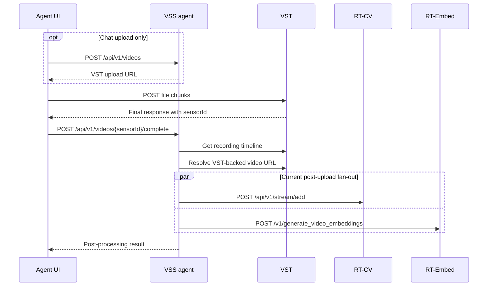
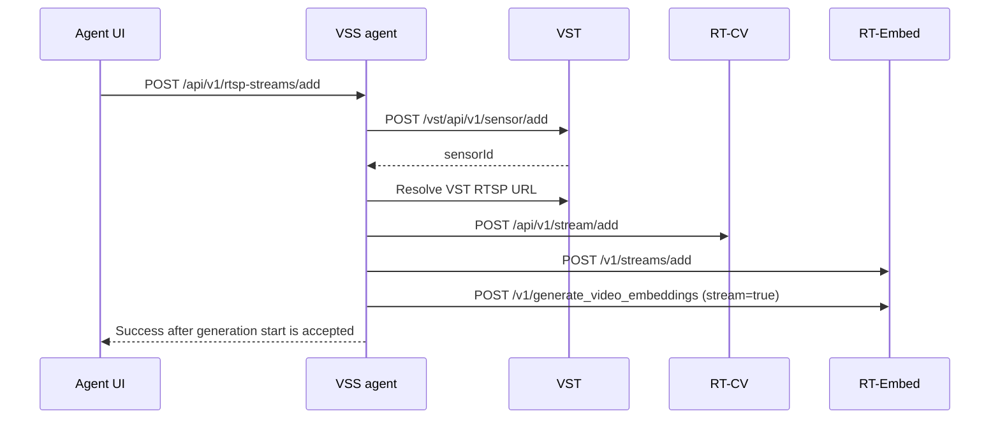
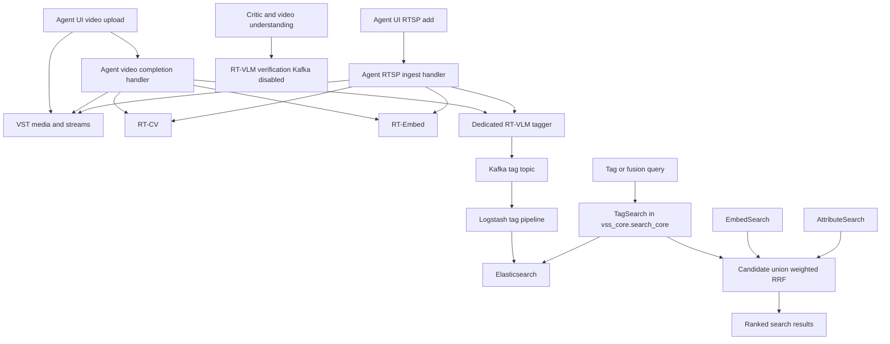

<!--
SPDX-FileCopyrightText: Copyright (c) 2026 NVIDIA CORPORATION & AFFILIATES. All rights reserved.
SPDX-License-Identifier: Apache-2.0

Licensed under the Apache License, Version 2.0 (the "License");
you may not use this file except in compliance with the License.
You may obtain a copy of the License at

http://www.apache.org/licenses/LICENSE-2.0

Unless required by applicable law or agreed to in writing, software
distributed under the License is distributed on an "AS IS" BASIS,
WITHOUT WARRANTIES OR CONDITIONS OF ANY KIND, either express or implied.
See the License for the specific language governing permissions and limitations under the License.
-->

# VLM Tagging Search

| Field | Value |
| --- | --- |
| Status | Draft for review |
| Target | Developer Search profile |
| Phase 1 | RTSP and uploaded-video tagging, BM25 keyword retrieval, and fusion |
| Phase 2 | Tag embeddings and semantic retrieval |
| Implementation boundary | Retrieval and fusion in `vss_core.search_core`; ingestion orchestration in `vss_agents`; deployment configuration in Docker and Helm |
| Source baseline | Rebased onto `origin/develop@bb6d269b87` on 2026-07-27 |
| Worktree | `feat/vlm_tag_search`; no commit or push |

## Executive summary

Phase 1 should support **both RTSP streams and uploaded videos**. RT-VLM already supports both media forms:

- stored media through `POST /v1/files` followed by `POST /v1/generate_captions`; and
- live RTSP through the stream APIs, including the CV-compatible `POST /v1/stream/add`.

The current VSS integration is asymmetric: RTSP ingestion has an optional RT-VLM registration hook, while
uploaded-video completion invokes only RT-CV and RT-Embed. Phase 1 closes that integration gap and gives both sources
the same searchable tag contract.

The Search profile deploys RT-VLM for the Critic and `video_understanding`, but disables RT-VLM Kafka publication.
RT-VLM is therefore present but is **not yet an ingestion-time tag producer**. Phase 1 adds a separate RT-VLM tagger
deployment with Kafka enabled, leaving the verification deployment Kafka-disabled.

## Current behavior on latest `develop`

### Search profile

- Latest `develop` deploys `vss-rtvi-vlm` for Critic verification and `video_understanding`.
- Search config sets `KAFKA_ENABLED=false` for RT-VLM because those uses are request/response.
- Search ingestion currently produces RT-CV attributes and RT-Embed vectors, not VLM tags.
- `vss_core.search_core` supports embed, attribute, fusion, and object search; it has no tag mode.
- Existing fusion builds every candidate from an embed result and then adds attribute evidence, so a tag-only or
  attribute-only candidate cannot enter the fused result set.
- The latest packaging refactor moved reusable search code into
  `services/agent/packages/vss_core/src/vss_core/search_core`; ingestion routes now live under the `vss_agents`
  package.

### When a video is uploaded through the Agent UI

The UI has two upload surfaces. They differ only in how the browser discovers the VST upload URL:

| UI surface | Before upload |
| --- | --- |
| Video Management | Builds the VST `/v1/storage/file` URL from its configured VST endpoint |
| Chat upload | Calls agent `POST /api/v1/videos` with the filename; the agent returns the configured VST upload URL |

The browser uploads the file chunks directly to VST in both cases. The agent is not in the media data path.



The `/complete` handler:

1. validates the VST `sensorId`;
2. reads the VST recording timeline;
3. asks VST for a URL covering that recording;
4. directly starts RT-CV registration and RT-Embed generation in parallel; and
5. returns after both tasks finish or surface their configured failure behavior.

The RT-Embed call processes the stored video synchronously. RT-CV connection and timeout failures are treated as an
optional-service skip, while an RT-CV non-2xx response or RT-Embed failure fails `/complete`. No RT-VLM tag request is
currently triggered.

### When an RTSP stream is added through the Agent UI



The UI sends `sensorUrl` and `name` to one agent endpoint. In the Search profile, the agent then directly performs the
steps above in order. Each RTVI call carries `x-stream-id` so an SDR-fronted deployment routes all operations for the
sensor to the same worker. This is still direct agent orchestration, not a lifecycle webhook.

The current handler has transactional rollback: if a downstream step fails, it removes already-created RT-Embed,
RT-CV, and VST state as applicable. The source also contains an LVS branch that calls RT-VLM
`POST /v1/streams/add` **instead of** RT-CV and RT-Embed when `rtvi_vlm_base_url` is configured. The Search profile does
not configure that branch, and it does not generate controlled tags.

### Current invocation summary

| Agent trigger | RT-CV | RT-Embed | RT-VLM tagging |
| --- | --- | --- | --- |
| `POST /api/v1/videos/{sensorId}/complete` | Direct `/api/v1/stream/add` with VST video URL | Direct `/v1/generate_video_embeddings` with VST video URL | Not triggered |
| `POST /api/v1/rtsp-streams/add` | Direct `/api/v1/stream/add` with VST RTSP URL | Direct `/v1/streams/add`, then `/v1/generate_video_embeddings` | Not triggered in Search |

### Webhooks and SDRC

The repository contains two mechanisms sometimes described as “webhooks,” but neither is the active Search RTVI
integration:

1. VST/VIOS can publish camera lifecycle notifications to Kafka/Redis, which SDRC consumes and routes to a configured
   workload add URL. Docker Search has VST notifications disabled. Helm Search configures SDRC only for the
   `camera_proxy` stream-processing workload.
2. SDRC has an optional post-provision HTTP callback (`WDM_CALL_WL_WEBHOOK` and `WDM_WL_WEBHOOK_ENDPOINT`). Search
   does not configure it for RT-CV, RT-Embed, or RT-VLM.

The VIOS notification mechanism is a valid target architecture, but it differs from current `develop`. Phase 1 will
retain direct agent fan-out and add RT-VLM alongside RT-CV and RT-Embed. Moving all three providers to VIOS/SDRC
routing should be a separate control-plane change; routing only RT-VLM through webhooks would create inconsistent
retry, rollback, and observability behavior.

### Existing indexing path

- RT-VLM Kafka enablement is process-wide. When enabled, every VLM chunk response is serialized as `nv.VisionLLM`;
  the current request models have no `publish_to_kafka`, tagging purpose, or document-type control.
- The configured RT-VLM caption topic is `mdx-vlm-captions`. The existing `mdx-lvs` Logstash pipeline consumes it,
  stores `llm.queries[0].response` as `text`, and preserves stream, sensor, chunk, and timestamp metadata.
- Logstash assigns `doc_type=raw_events`, writes to `default_<streamId>`, creates a deterministic document ID, and adds
  a deterministic 1024-dimensional placeholder vector. Phase 1 uses BM25 over `text`; it does not use this vector.
- `streamId` is the RT-VLM asset UUID. `sensorId` is the VST identity when RT-VLM receives `camera_id` for RTSP or
  `sensor_name` for an uploaded file.
- `vss_core.knowledge.adapters.es_caption` already demonstrates BM25 retrieval over `text`; it is a behavioral
  reference, not the new public API.

## Phase 1 scope

### In scope

- Controlled-vocabulary tags for five-second chunks.
- RTSP and uploaded-video tag production.
- BM25 keyword search with source, video/sensor, and time filters.
- Fusion of tag, embedding, and optional attribute candidates.
- Docker and Helm configuration needed to enable tag publication.
- Unit, integration, and one end-to-end test for each ingestion type.

### Out of scope

- Tag embeddings or semantic tag retrieval.
- Historical backfill and automatic retagging.
- UI changes.
- Model fine-tuning or ontology management.
- Generalized post-search VLM verification; the existing Critic flow remains independent.
- A mandatory Elasticsearch mapping migration.

## Phase 1 design



### Control-plane decision

For Phase 1, the VSS agent remains the ingestion controller:

- `POST /api/v1/rtsp-streams/add` retains the existing VST → RT-CV → RT-Embed path and additionally starts RT-VLM
  tagging.
- `POST /api/v1/videos/{sensorId}/complete` retains timeline and VST URL resolution, then additionally starts RT-VLM
  tagging alongside the existing RT-CV and RT-Embed work.
- Each provider has explicit status, retry, and cleanup behavior.
- The agent sends ingestion work to the dedicated tagger endpoint. Critic and `video_understanding` continue using the
  existing verification endpoint.
- Add a distinct `rtvi_vlm_tagger_base_url` ingestion setting. Do not reuse the current `rtvi_vlm_base_url` semantics,
  which select the exclusive LVS branch in the RTSP handler.

VIOS/SDRC lifecycle routing remains an architectural option outside Phase 1.

### Common tag contract

Use a deployment-configured vocabulary and deterministic prompt. Request JSON-only output, temperature `0`, and one
response per five-second interval.

```json
{"tags":["forklift","worker","yellow safety vest","moving pallet"]}
```

Constraints:

- one object containing one `tags` array;
- lowercase controlled labels;
- at most 32 unique tags;
- only the current chunk;
- no prose, confidence values, or Markdown.

Malformed output is observable and skipped during retrieval; it must not fail the entire search request.

### RTSP path

1. Keep RT-CV and RT-Embed enabled; RT-VLM tagging is additive.
2. On RTSP add, call the tagger's CV-compatible `POST /v1/stream/add` with the VST RTSP URL, VST `sensorId` as
   `camera_id`, five-second chunking, `response_format_type=json_object`, temperature `0`, and `metadata.prompt`.
3. Treat the add as successful only when the response contains `inference=true`. The current RT-VLM handler can return
   HTTP 200 with `inference=false` when stream registration succeeds but inference startup fails.
4. RT-VLM runs continuous asynchronous inference and publishes `nv.VisionLLM` records.
5. On RTSP delete, call `POST /v1/stream/remove` with the same `camera_id` to stop inference and clean the tagger asset.

The current RTSP `if RT-VLM else RT-CV + RT-Embed` branch must become independent provider fan-out.

### Uploaded-video path

1. Retain the current VST upload and completion handshake.
2. Extend the existing `/videos/{sensorId}/complete` handler. After the VST URL is resolved, run RT-CV, RT-Embed,
   and RT-VLM tagging as independent post-upload tasks.
3. Register the VST-backed HTTP(S) URL with `POST /v1/files`, using `purpose=vision`, `media_type=video`, the recording
   creation time, and `id=<VST sensorId>`. VST sensor IDs are UUIDs and the RT-VLM file API accepts an optional UUID,
   so this preserves identity even though the current URL-upload branch does not propagate `sensor_name`. RT-VLM
   fetches the media server-side; bytes do not pass through the agent.
4. Call `POST /v1/generate_captions` with the returned asset UUID, the controlled prompt, five-second chunks,
   `response_format.type=json_object`, and temperature `0`.
5. After generation reaches a terminal state, delete the temporary RT-VLM asset with `DELETE /v1/files/{assetId}`.
6. Publish the same `nv.VisionLLM` and indexed shape as RTSP. For uploaded video, the RT-VLM asset UUID, `streamId`,
   and `sensorId` all equal the VST sensor ID.

`POST /v1/chat/completions` accepts `video_url`, but it is not the preferred ingestion API because
`generate_captions` provides chunked responses with explicit start and end times.

### Kafka and indexing

Current RT-VLM code has only instance-wide Kafka enablement. Phase 1 therefore deploys a separate logical
`rtvi-vlm-tagger` with `KAFKA_ENABLED=true` and `KAFKA_TOPIC=mdx-vlm-captions`. The existing `vss-rtvi-vlm` remains
Kafka-disabled for Critic and `video_understanding`. This prevents verification responses from entering the caption
topic and isolates interactive verification from ingestion load. The tagger is a separate RT-VLM API process or pod;
it may use the same remote model backend and does not inherently require a second model deployment.

Reuse the current `mdx-lvs` Logstash pipeline and indexed shape:

```json
{
  "text": "{\"tags\":[\"forklift\",\"worker\"]}",
  "vector": [0.123, 0.456],
  "sensor": {
    "id": "vst-sensor-id",
    "type": "Camera"
  },
  "metadata": {
    "source": "N/A",
    "content_metadata": {
      "streamId": "rtvi-asset-uuid",
      "sensorId": "vst-sensor-id",
      "cameraId": "vst-sensor-id",
      "chunkIdx": 12,
      "doc_type": "raw_events",
      "uuid": "rtvi-asset-uuid",
      "start_ntp_float": 1785000000.0,
      "end_ntp_float": 1785000005.0
    }
  }
}
```

The vector is abbreviated above; Logstash writes 1024 deterministic float values. For uploaded videos,
`sensor.type=Video` and `cameraId` may be absent; using the VST UUID as the RT-VLM file ID keeps `sensorId` stable. The
existing deterministic document ID provides idempotent indexing for Kafka redelivery. Phase 1 filters
`doc_type=raw_events`, searches `default_*`, and scopes results by sensor type, `sensorId`, and interval. It does not
require a mapping change or a native `tags` field.

### Library API

Add the tag primitive under `vss_core.search_core` and expose it through the existing runtime/facade pattern. This is
the current reusable library boundary for Search.

```text
TagSearchInput
  query
  source_type: rtsp | video_file
  video_sources
  timestamp_start
  timestamp_end
  top_k

TagSearchResultItem
  video_name
  description
  start_time
  end_time
  sensor_id
  screenshot_url
  lexical_score
```

Search modes:

- `tag`: BM25 tag retrieval only;
- `embed`: unchanged;
- `attribute`: unchanged;
- `fusion`: tag + embed + optional attribute;
- `object`: unchanged.

Adding `tag` to the current `SearchInput.search_mode` literal and `TagSearch` to the lazy facade/runtime registration
is part of Phase 1. Fusion validation must also allow tag + embed without requiring attributes.

The Elasticsearch query uses `match` on `text`, `sensor.type` for source type, `sensorId` for selected sources, and
the stored NTP-float interval fields:

```text
metadata.content_metadata.start_ntp_float <= requested.end
AND metadata.content_metadata.end_ntp_float >= requested.start
```

Normalize matching hits to the existing Search result shape. Resolve `video_name` and browser-facing
`screenshot_url` through VST because the caption document may have `metadata.source=N/A`. BM25 `_score` remains
lexical and is never compared directly with cosine similarity.

### Fusion

Use weighted reciprocal-rank fusion over the union of provider candidates:

```text
score(c) =
  w_tag       / (k + tag_rank)
  + w_embed   / (k + embed_rank)
  + w_attribute / (k + attribute_rank)
```

Align candidates by sensor and overlapping time interval. An absent provider contributes zero. Tag-only and embed-only
candidates remain eligible; candidates supported by multiple retrieval spaces are promoted.

### Failure behavior

- Tag-only mode returns a typed error when Elasticsearch/tag retrieval is unavailable.
- A malformed individual document is skipped and counted.
- No match is a successful empty result.
- Fusion returns partial results plus degradation metadata when one provider fails.
- If every selected provider fails, return a typed error.
- Tagging failure does not roll back successful VST upload, RT-CV registration, or embeddings; expose per-provider
  completion state so the caller can retry tagging.
- Critic and `video_understanding` requests never create tag-search documents.
- An RTSP tagger response with `inference=false` is a tagging failure even when its HTTP status is 200.

## Phase 1 delivery plan

Workstreams are ordered by dependency. Ingestion implementation starts after the contracts and RT-VLM publication
contract is complete. Retrieval starts after the indexed document contract is frozen.

| Workstream | Deliverables | Exit gate |
| --- | --- | --- |
| 1. Contracts and evidence | Exercise the deployed `/v1/stream/add`, `/v1/stream/remove`, `/v1/files`, and `/v1/generate_captions` APIs; capture representative RTSP and uploaded-video `nv.VisionLLM` records; freeze controlled vocabulary, prompt, chunk duration, sensor/video identity, timestamp, document, error, and evaluation contracts | Both media paths have validated request/response samples and one approved contract |
| 2. RT-VLM tagger deployment | Add a separate `rtvi-vlm-tagger` service with Kafka enabled; keep the verification RT-VLM Kafka-disabled; configure endpoint, model backend, topic, capacity, health checks, and resource limits | Only the tagger publishes to `mdx-vlm-captions`, and verification traffic remains absent from the topic |
| 3. RTSP tag production | Add `rtvi_vlm_tagger_base_url`; make RT-VLM additive in `POST /api/v1/rtsp-streams/add`; send the controlled prompt and VST sensor identity; require `inference=true`; update the delete handler to use `/v1/stream/remove`; implement retry, status, and cleanup behavior without replacing RT-CV or RT-Embed | Adding an RTSP stream starts CV, embeddings, and VLM tagging; deleting it stops all owned tag work |
| 4. Uploaded-video tag production | Extend `POST /api/v1/videos/{sensorId}/complete`; register the VST HTTP(S) URL through `/v1/files`; invoke `/v1/generate_captions`; preserve the current browser-to-VST upload flow; delete the temporary RT-VLM asset | Upload completion produces tags for the full VST timeline without sending media bytes through the agent |
| 5. Kafka and Elasticsearch | Reuse the `mdx-lvs` Logstash pipeline, `raw_events` documents, `default_*` indexes, and deterministic IDs; verify `streamId`, `sensorId`, chunk, and interval metadata; confirm mapping and retention | One queryable document exists per source chunk, and Kafka redelivery does not create duplicates |
| 6. Library retrieval | Add tag input/result models, Elasticsearch adapter, BM25 query, source/video/time filters, interval normalization, runtime registration, and public facade under `vss_core.search_core` | Tag-only search returns normalized results for RTSP and uploaded video through the reusable library API |
| 7. Fusion | Replace the current embed-owned candidate model with candidate union; align by sensor and overlapping interval; apply configurable weighted RRF; retain tag-only, embed-only, and attribute-only candidates; update `SearchInput` validation for fusion without attributes | Deterministic tests prove single-provider survival and multi-provider promotion |
| 8. Configuration and packaging | Add Docker and Helm values for tag enablement, tagger endpoint, topic, vocabulary/prompt version, chunk duration, weights, timeouts, concurrency, and feature flags; add health/readiness checks and resource limits | Docker and Helm render equivalent Search configurations and start with a documented safe default |
| 9. Reliability and observability | Add structured logs and metrics for tag requests, chunks, malformed output, publish/index failures, retries, deduplication, queue depth, and latency; define partial-failure and retry behavior; prevent credentials and raw media URLs from leaking into logs | Operators can identify a failed source/chunk and retry tagging without rolling back VST, RT-CV, or embeddings |
| 10. Verification | Add unit tests for parsing, filters, normalization, deduplication, and RRF; contract tests for RT-VLM and `nv.VisionLLM`; integration tests for Kafka/Logstash/Elasticsearch; end-to-end tests for both UI ingestion paths; regression tests for embed, attribute, object, Critic, and `video_understanding`; concurrency and latency checks | All acceptance criteria pass with recorded evidence and no regression in existing Search or verification flows |
| 11. Rollout and handoff | Deploy behind feature flags; enable tag production only in the validation environment; run ingestion smoke tests; validate index quality and isolation; enable tag-only search, then fusion; document configuration, dashboards, operational retry, rollback, and Phase 2 inputs | Feature is enabled for users only after smoke and relevance gates pass; rollback disables tag production/retrieval without affecting existing providers |

## Acceptance criteria

- RTSP add starts tag inference with `inference=true`; RTSP delete stops it through `/v1/stream/remove`.
- Uploaded-video completion tags the full VST timeline without proxying media bytes through the agent and removes the
  temporary RT-VLM asset.
- A controlled tag retrieves the correct RTSP interval.
- The same tag retrieves the correct uploaded-video interval.
- Phrase and multi-token BM25 queries work.
- Video/sensor and time filters exclude unrelated chunks.
- Tag-only and embed-only candidates survive fusion.
- Multi-provider candidates are promoted.
- Malformed tag documents do not fail a query.
- One provider outage produces documented partial fusion behavior.
- Existing embed, attribute, object, Critic, and `video_understanding` flows remain regression-free.
- A tagging request emits one `raw_events` tag record per chunk.
- Kafka redelivery overwrites the same deterministic document rather than creating a duplicate.
- Equivalent Critic and `video_understanding` requests emit no tag records and create no tag-search documents.
- The limitation is explicit: a synonym such as `industrial vehicle` may not match `forklift` in Phase 1.

## Open decision

Does RT-VLM support request-level Kafka publication control so ingestion/tagging requests can publish while Critic
verification requests do not?

The checked-in implementation currently exposes only process-wide `KAFKA_ENABLED` and publishes every processed VLM
chunk when enabled. Unless a supported per-request control is confirmed, Phase 1 uses the dedicated RT-VLM tagger
deployment described above.

## Phase 2

- Generate embeddings from normalized tags/captions in a downstream subscriber or general Embedding service.
- Evaluate Nemotron 3 and Cosmos Embed against the Phase 1 lexical baseline.
- Store versioned vectors in a dedicated field/index.
- Add semantic tag retrieval and hybrid lexical/semantic fusion.
- Evaluate synonym recall, vocabulary drift, latency, and cost.

## References

- [Latest Slack design thread](https://nvidia.slack.com/archives/C09U4FD1R4P/p1784635625550279)
- [Search RT-VLM integration PR #1369](https://github.com/NVIDIA-AI-Blueprints/video-search-and-summarization/pull/1369)
- [Search-core refactor PR #1170](https://github.com/NVIDIA-AI-Blueprints/video-search-and-summarization/pull/1170)
- [RT-VLM overview](https://docs.nvidia.com/vss/latest/real-time-vlm.html)
- [RT-VLM API](https://docs.nvidia.com/vss/latest/real-time-vlm-api.html)
- `services/ui/packages/common/lib-src/utils/videoUpload.ts`
- `services/ui/packages/nv-metropolis-bp-vss-ui/video-management/lib-src/VideoManagementComponent.tsx`
- `services/ui/packages/nv-metropolis-bp-vss-ui/video-management/lib-src/rtspStream.ts`
- `services/agent/packages/vss_agents/src/vss_agents/api/rtsp_ingest.py`
- `services/agent/packages/vss_agents/src/vss_agents/api/rtsp_delete.py`
- `services/agent/packages/vss_agents/src/vss_agents/api/video_ingest.py`
- `services/agent/packages/vss_core/src/vss_core/search_core`
- `services/rtvi/rt-vlm/src/api_models/live_stream.py`
- `services/rtvi/rt-vlm/src/server/rtvi_vlm_server.py`
- `services/rtvi/rt-vlm/src/server/rtvi_stream_handler.py`
- `deploy/docker/services/infra/elk/logstash/pipelines/kafka/mdx-lvs-logstash.conf`
- `deploy/docker/developer-profiles/dev-profile-search/video-analytics-2d-app/nvstreamer/configs/vst-config.json`
- `deploy/helm/developer-profiles/dev-profile-search/configs/sdrc/config-search.yml`
- `services/sdrc/config.yml`
- `skills/vss-deploy-dense-captioning/references/api-surface-26.05.md`
