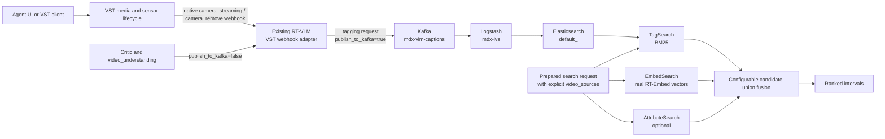

<!--
SPDX-FileCopyrightText: Copyright (c) 2026 NVIDIA CORPORATION & AFFILIATES. All rights reserved.
SPDX-License-Identifier: Apache-2.0

Licensed under the Apache License, Version 2.0 (the "License");
you may not use this file except in compliance with the License.
You may obtain a copy of the License at

http://www.apache.org/licenses/LICENSE-2.0

Unless required by applicable law or agreed to in writing, software
distributed under the License is distributed on an "AS IS" BASIS,
WITHOUT WARRANTIES OR CONDITIONS OF ANY KIND, either express or implied.
See the License for the specific language governing permissions and limitations under the License.
-->

# VLM Tagging Search

| Field | Value |
| --- | --- |
| Status | Draft for review |
| Phase 1 | RTSP and uploaded-video tagging, BM25 keyword retrieval, and configurable fusion |
| Phase 2 | Semantic retrieval over real tag/caption embeddings |
| Search boundary | Retrieval and fusion live in `vss_core.search_core` |
| Ingestion boundary | VST native webhooks invoke the existing RT-VLM; SDRC is not in the VLM tagging path |
| Source baseline | `origin/develop@875616c37`, 2026-08-05 |

## Summary

Phase 1 makes RT-VLM output searchable for both RTSP streams and uploaded videos. VST lifecycle webhooks start and
stop tagging on the existing RT-VLM deployment. Tagging requests explicitly publish chunk results to Kafka; Critic
and `video_understanding` requests explicitly do not. Kafka, the existing `mdx-lvs` Logstash pipeline, and
Elasticsearch provide the indexing path.

Search adds BM25 retrieval over the indexed VLM text and fuses its ranked candidates with the existing video-embedding
and optional attribute results. Every tag or fusion query must name its video sources. The `default_*` index family is
never searched without a mandatory source-identity filter.

Phase 1 does not treat the vector currently stored in `default_*` as a semantic embedding. That value is a deterministic
placeholder. Real tag/caption embeddings are Phase 2.

## Goals

- Generate controlled, chunk-level tags for RTSP streams and uploaded videos.
- Reuse the existing RT-VLM deployment for tagging and verification.
- Use VST native HTTP webhooks directly; do not require SDRC for VLM lifecycle orchestration.
- Keep tagging publication separate from Critic and `video_understanding` traffic.
- Support source-scoped BM25 tag search in `vss_core.search_core`.
- Fuse tag, video-embedding, and optional attribute candidate sets without dropping single-provider results.
- Let operators select the fusion method and tune its weights without a code change.

## Non-goals

- Semantic tag retrieval or tag embeddings in Phase 1.
- Historical backfill, automatic retagging, or ontology management.
- Model fine-tuning.
- UI changes.
- Replacing the existing RT-CV or RT-Embed ingestion paths.
- Using SDRC as the VLM webhook intermediary.
- Deploying a second `rtvi-vlm-tagger` service.

## Current state

- The Search profile already deploys RT-VLM for Critic verification and `video_understanding`.
- RT-VLM Kafka enablement is process-wide today. When enabled, every processed VLM chunk can be published; request
  models do not distinguish tagging from interactive verification.
- VST supports native HTTP lifecycle webhooks for both `rtsp` and `file` camera types. It emits `camera_add`,
  `camera_streaming`, and `camera_remove` events, supports camera-type filters, retries, timeouts, headers, and HMAC
  authentication. `camera_streaming` carries the usable media URL.
- The existing `mdx-vlm-captions` topic and `mdx-lvs` Logstash pipeline write RT-VLM `nv.VisionLLM` records to the
  `default_<streamId>` Elasticsearch index family.
- Existing video semantic search uses real RT-Embed vectors in `mdx-embed-filtered-*`.
- The `vector` stored by `mdx-lvs` in `default_*` is not a model embedding. It is a deterministic 1,024-dimensional
  pseudo-random `NullEmbedding`, seeded from the document text, that keeps the vector mapping valid.

## Target architecture



RT-CV and RT-Embed retain their current lifecycle orchestration. This design changes only the VLM tagging control
path: VST calls RT-VLM directly through a webhook-compatible endpoint, with no SDRC hop.

## VST webhook contract

Configure VST native webhooks for `camera_type=["rtsp", "file"]`:

| VST event | RT-VLM behavior |
| --- | --- |
| `camera_add` | Record desired lifecycle state if needed; do not start inference because `camera_url` is empty |
| `camera_streaming` | Validate the signed event and start idempotent tagging using `event.camera_id`, `camera_type`, and `camera_url` |
| `camera_remove` | Stop RTSP inference or delete the temporary uploaded-video asset; repeated removal is successful |

Phase 1 adds a webhook adapter endpoint to the existing RT-VLM. It accepts the VST `camera_status_change` payload and
translates it to the existing stream or file APIs. This is an adapter inside the existing RT-VLM service, not another
deployment.

Requirements:

- Verify the VST HMAC signature before accepting an event.
- Allowlist `rtsp`, `rtsps`, `http`, and `https` schemes according to `camera_type`; reject all other URLs.
- Treat `(camera_id, lifecycle state)` as idempotent because VST retries webhook delivery.
- Return a non-2xx response for retryable admission failures and a 2xx response only after work is durably accepted.
- Preserve `camera_id` as the canonical VST `sensorId` in every published record.
- Emit structured status for accepted, running, completed, failed, and removed work.

### RTSP

For a `camera_streaming` event with `camera_type=rtsp`, the adapter starts the existing RT-VLM stream path with:

- `camera_id=<VST camera_id>`;
- the VST-provided RTSP URL;
- the controlled tag prompt;
- five-second chunks;
- `response_format_type=json_object` and `temperature=0`; and
- `publish_to_kafka=true`.

The request is successful only when inference starts. A response containing `inference=false` is a failure even if
the HTTP status is 200. `camera_remove` invokes the existing stream removal behavior with the same `camera_id`.

### Uploaded video

For a `camera_streaming` event with `camera_type=file`, the adapter:

1. registers the VST HTTP(S) URL through `POST /v1/files`, using the VST `camera_id` as the RT-VLM asset identity;
2. calls `POST /v1/generate_captions` with the controlled prompt, five-second chunks, JSON response format,
   temperature `0`, and `publish_to_kafka=true`; and
3. deletes the temporary RT-VLM asset after a terminal result, or when `camera_remove` is received.

RT-VLM fetches the VST URL server-side. Media bytes do not pass through the Agent, webhook adapter, or skill process.

## One RT-VLM deployment and publication isolation

Phase 1 extends RT-VLM with request-scoped publication control. `KAFKA_ENABLED=true` means the process has Kafka
capability; it does not by itself authorize a request to publish.

Add the following request contract to every RT-VLM path that can produce chunk responses:

```text
publish_to_kafka: boolean = false
request_purpose: tagging | verification = verification
```

Publication occurs only when all conditions are true:

```text
KAFKA_ENABLED
AND request.publish_to_kafka
AND request.request_purpose == "tagging"
```

The VST webhook adapter always submits `tagging` plus `publish_to_kafka=true`. Critic, `video_understanding`, and
`vss-ask-video` use the safe defaults and never publish. Missing or malformed publication fields fail closed.

Tagging and verification share the RT-VLM API deployment and model backend. Separate internal admission queues,
concurrency limits, and metrics prevent continuous tagging from starving interactive verification; they do not require
a second RT-VLM service.

## Prompt and indexed document contract

The tag prompt is deployment configuration with a validated default. It asks for JSON only:

```json
{
  "tags": ["forklift", "worker", "loading"],
  "description": "A worker loads a pallet beside a forklift."
}
```

Tags are normalized to trimmed lowercase strings, deduplicated, length-limited, and capped per chunk. Invalid model
JSON is recorded as an ingestion failure and is not published as a valid tag document.

RT-VLM publishes the existing `nv.VisionLLM` shape to `mdx-vlm-captions`. The existing `mdx-lvs` pipeline stores:

```json
{
  "text": "{\"tags\":[\"forklift\",\"worker\"],\"description\":\"A worker stands beside a forklift.\"}",
  "vector": [0.123, 0.456],
  "sensor": {
    "id": "vst-sensor-id",
    "type": "Camera"
  },
  "metadata": {
    "source": "N/A",
    "content_metadata": {
      "streamId": "vst-sensor-id",
      "sensorId": "vst-sensor-id",
      "cameraId": "vst-sensor-id",
      "chunkIdx": 12,
      "doc_type": "raw_events",
      "start_ntp_float": 1785000000.0,
      "end_ntp_float": 1785000005.0
    }
  }
}
```

For uploaded video, `sensor.type=Video`. `streamId` and `sensorId` remain tied to the canonical VST identity. The
deterministic document ID makes Kafka redelivery an upsert.

The abbreviated `vector` above is the deterministic 1,024-dimensional `NullEmbedding` produced by Logstash. It is
not semantically related to the tags and is never queried in Phase 1. By contrast, `mdx-embed-filtered-*` contains
real video embeddings computed by RT-Embed; those vectors continue to power the embed provider in fusion.

## Tag search API and source isolation

The reusable API lives under `vss_core.search_core`:

```text
TagSearchInput
  query
  source_type: rtsp | video_file
  video_sources: non-empty list
  timestamp_start
  timestamp_end
  top_k

TagSearchResultItem
  video_name
  description
  tags
  start_time
  end_time
  sensor_id
  screenshot_url
  lexical_score
```

Search modes are `tag`, `embed`, `attribute`, `fusion`, and `object`. Tag mode and fusion mode require at least one
explicit `video_source`. There is no implicit all-sources search in Phase 1. An unresolved source is an input error;
the implementation must not silently broaden the query.

For each request:

1. Resolve every requested VST source name or ID to its canonical `sensorId`.
2. Use exact `default_<streamId>` indexes when the source-to-index identity is known.
3. If an exact index cannot be derived, use the configured `default_*` family only with mandatory `sensorId` terms.
4. Filter by `sensor.type`, the resolved source IDs, and interval overlap.
5. Run BM25 `match` against `text` and normalize the hit to the common `SearchResult` shape.

Interval overlap is:

```text
document.start_ntp_float <= requested.end
AND document.end_ntp_float >= requested.start
```

The BM25 `_score` is used only to rank tag-provider results. It is never compared numerically with cosine similarity.

## Configurable fusion

Fusion operates over the union of tag, embed, and optional attribute candidates. Candidates align only when they have
the same canonical sensor and overlapping time intervals. A missing provider contributes zero; tag-only, embed-only,
and attribute-only candidates remain eligible.

Phase 1 supports two rank-based methods:

| Method | Behavior |
| --- | --- |
| `weighted_rrf` | Weighted reciprocal-rank fusion; the default |
| `rrf` | Standard reciprocal-rank fusion with equal contribution from each enabled provider |

For `weighted_rrf`:

```text
score(c) =
    w_tag       / (k + tag_rank)
  + w_embed     / (k + embed_rank)
  + w_attribute / (k + attribute_rank)
```

An absent rank contributes zero. All terms are additive.

Expose these settings through `SearchRuntime`, deployment configuration, and the `vss search` CLI:

```text
fusion_method: weighted_rrf | rrf
w_tag: non-negative float
w_embed: non-negative float
w_attribute: non-negative float
rrf_k: positive integer
```

CLI overrides are `--fusion-method`, `--w-tag`, `--w-embed`, `--w-attribute`, and `--rrf-k`. At least one enabled
provider must have a positive weight. The Agent uses profile defaults; the LLM does not invent per-query weights.
Adding score-based fusion is deferred until every provider has a validated normalization strategy.

## Failure, security, and observability

- Tag-only search returns a typed backend error when Elasticsearch is unavailable and an empty result for no match.
- Fusion returns partial results plus degradation metadata when one provider fails; it fails when every provider fails.
- Cancellation propagates and is never converted into provider degradation.
- Malformed individual Elasticsearch documents are skipped and counted.
- Tagging failure does not roll back a successful VST upload or RT-CV/RT-Embed work.
- Critic and `video_understanding` requests never create tag-search documents.
- Webhook authentication failures, unsupported URLs, and malformed payloads are rejected without starting work.
- Logs must not contain webhook secrets, credentials, or raw signed URLs.
- Metrics cover webhook delivery/admission, active tagging jobs, chunk latency, invalid model output, Kafka publication,
  indexing lag, provider degradation, source-filter rejection, and fusion latency.

## Phase 1 delivery plan

| Workstream | Deliverables | Exit gate |
| --- | --- | --- |
| 1. Contracts | Validate VST `camera_streaming` and `camera_remove` payloads for RTSP and file sensors; freeze identity, timestamp, prompt, and tag JSON contracts | Representative signed events and indexed documents are approved for both source types |
| 2. Shared RT-VLM | Add the VST webhook adapter, request-scoped Kafka fields, fail-closed publication gate, idempotent lifecycle handling, and separate admission limits for tagging and verification | One RT-VLM serves both workloads; only explicit tagging requests publish |
| 3. RTSP tagging | Translate RTSP lifecycle events to stream add/remove, preserve VST identity, require successful inference startup, and publish five-second chunks | Add starts tags and remove stops them without SDRC |
| 4. Uploaded-video tagging | Translate file lifecycle events to file registration and caption generation; fetch media from VST; clean temporary assets | A completed upload produces full-timeline tags without proxying media bytes |
| 5. Index validation | Reuse `mdx-vlm-captions`, `mdx-lvs`, deterministic IDs, and the current document shape; verify retention and identity filters | Each chunk is queryable and redelivery does not duplicate it |
| 6. Library retrieval | Add tag models, BM25 query, mandatory source resolution, exact-index selection where possible, time filters, VST result enrichment, and public facade registration in `vss_core.search_core` | Tag search returns only selected-source intervals for RTSP and uploaded video |
| 7. Fusion | Implement union alignment and method dispatch for `weighted_rrf` and `rrf`; expose all weights and `rrf_k` through runtime and CLI | Tests prove method selection, weight changes, multi-provider promotion, and single-provider survival |
| 8. Verification and rollout | Add unit, contract, integration, and end-to-end tests; add metrics and dashboards; gate enablement behind configuration; document rollback | Search and verification regressions pass, publication isolation is proven, and disabling tagging leaves existing search intact |

## Acceptance criteria

- VST invokes RT-VLM directly for both RTSP and uploaded-video lifecycle events; SDRC is absent from the VLM path.
- The existing RT-VLM deployment handles both tagging and verification.
- An explicit tagging request produces one `raw_events` record per chunk.
- Equivalent Critic, `video_understanding`, and `vss-ask-video` requests produce no tag records.
- RTSP add starts inference and RTSP remove stops it idempotently.
- Uploaded-video tagging covers the full VST timeline and removes its temporary RT-VLM asset.
- A tag query without `video_sources` is rejected.
- Selected source and time filters exclude every unrelated chunk, including documents in other `default_*` indexes.
- BM25 retrieves controlled tags for both source types.
- The `default_*` placeholder vector is never used for semantic retrieval.
- Operators can select `weighted_rrf` or `rrf` and change every fusion weight without modifying code.
- Tag-only, embed-only, and attribute-only candidates survive fusion; multi-provider candidates are promoted.
- One provider outage yields partial results with degradation metadata; cancellation propagates.
- Kafka redelivery overwrites the deterministic document ID instead of creating a duplicate.
- Existing embed, attribute, object, Critic, and `video_understanding` behavior remains regression-free.

## Required validation before implementation completion

1. Confirm the exact VST `camera_id` used by RTSP `camera_streaming` is stable and can be mapped to the corresponding
   `default_<streamId>` index. Until confirmed, retain the mandatory `sensorId` filter even when an exact index is used.
2. Confirm request-scoped publication is accepted as an RT-VLM API change and is propagated through every chunk-producing
   entry point. Phase 1 must not enable process-wide publication without this gate.
3. Tune the default prompt, `w_tag`, `w_embed`, `w_attribute`, and `rrf_k` against a labeled RTSP and uploaded-video
   relevance set before enabling fusion by default.

## Phase 2

- Generate a real embedding from normalized tags and descriptions using a versioned embedding model.
- Store the semantic vector in a dedicated field or index; never overwrite or reinterpret the Phase 1 placeholder.
- Add semantic tag retrieval and lexical/semantic hybrid fusion.
- Evaluate synonym recall, vocabulary drift, latency, storage, and cost against the Phase 1 BM25 baseline.

## References

- [Latest Slack design thread](https://nvidia.slack.com/archives/C09U4FD1R4P/p1784635625550279)
- [Search RT-VLM integration PR #1369](https://github.com/NVIDIA-AI-Blueprints/video-search-and-summarization/pull/1369)
- [RT-VLM overview](https://docs.nvidia.com/vss/latest/real-time-vlm.html)
- [RT-VLM API](https://docs.nvidia.com/vss/latest/real-time-vlm-api.html)
- `services/vios/configs/notification_config.json`
- `services/vios/test/bdd_tests/features/notification/webhook_notifications.feature`
- `services/vios/test/bdd_tests/tests/notification/test_webhook_notifications.py`
- `services/rtvi/rt-vlm/src/api_models/live_stream.py`
- `services/rtvi/rt-vlm/src/server/rtvi_vlm_server.py`
- `services/rtvi/rt-vlm/src/server/rtvi_stream_handler.py`
- `deploy/docker/services/infra/elk/logstash/pipelines/kafka/mdx-lvs-logstash.conf`
- `services/agent/packages/vss_core/src/vss_core/search_core`
