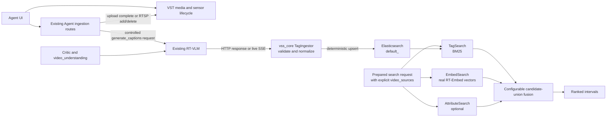

<!--
SPDX-FileCopyrightText: Copyright (c) 2026 NVIDIA CORPORATION & AFFILIATES. All rights reserved.
SPDX-License-Identifier: Apache-2.0

Licensed under the Apache License, Version 2.0 (the "License");
you may not use this file except in compliance with the License.
You may obtain a copy of the License at

http://www.apache.org/licenses/LICENSE-2.0

Unless required by applicable law or agreed to in writing, software
distributed under the License is distributed on an "AS IS" BASIS,
WITHOUT WARRANTIES OR CONDITIONS OF ANY KIND, either express or implied.
See the License for the specific language governing permissions and limitations under the License.
-->

# VLM Tagging Search

| Field | Value |
| --- | --- |
| Status | Draft for review |
| Phase 1 | RTSP and uploaded-video tagging, BM25 keyword retrieval, and configurable fusion |
| Phase 2 | Semantic retrieval over real tag/caption embeddings |
| Search boundary | Retrieval and fusion live in `vss_core.search_core` |
| Ingestion boundary | Existing Agent uploaded-video and RTSP lifecycle routes orchestrate the existing RT-VLM |
| Source baseline | `origin/develop@2b0a793f9`, 2026-08-12 |

## Summary

Phase 1 makes RT-VLM output searchable for both RTSP streams and uploaded videos. The existing Agent ingestion routes
start and stop tagging on the existing RT-VLM deployment. The Agent consumes RT-VLM HTTP or SSE responses, validates
the controlled JSON contract, and writes only valid tag documents to Elasticsearch. This keeps tagging isolated from
Critic and `video_understanding` without changing RT-VLM or relying on its process-wide Kafka setting.

Search adds BM25 retrieval over the indexed VLM text and fuses its ranked candidates with the existing video-embedding
and optional attribute results. Every tag or fusion query must name its video sources. The `default_*` index family is
never searched without a mandatory source-identity filter.

Phase 1 tag documents contain no semantic vector. Real tag/caption embeddings are Phase 2.

## Goals

- Generate controlled, chunk-level tags for RTSP streams and uploaded videos.
- Reuse the existing RT-VLM deployment for tagging and verification.
- Reuse the existing Agent-managed upload-complete and RTSP add/delete lifecycle.
- Keep tag indexing separate from Critic and `video_understanding` traffic.
- Support source-scoped BM25 tag search in `vss_core.search_core`.
- Fuse tag, video-embedding, and optional attribute candidate sets without dropping single-provider results.
- Let operators select the fusion method and tune its weights without a code change.

## Non-goals

- Semantic tag retrieval or tag embeddings in Phase 1.
- Historical backfill, automatic retagging, or ontology management.
- Model fine-tuning.
- UI changes.
- Replacing the existing RT-CV or RT-Embed ingestion paths.
- Adding VST webhook or SDRC orchestration for VLM tagging.
- Changing RT-VLM, RT-CV, RT-Embed, or VIOS source code.
- Deploying a second `rtvi-vlm-tagger` service.

## Current state

- The Search profile already deploys RT-VLM for Critic verification and `video_understanding`.
- Uploaded-video completion already resolves the VST timeline and playable URL, then calls RT-CV and RT-Embed.
- RTSP add/delete already owns the VST, RT-CV, and RT-Embed lifecycle with admission checks and rollback.
- RT-VLM Kafka enablement is process-wide and cannot distinguish tagging from interactive verification per request.
- The Search profile already provides the Agent with RT-VLM and Elasticsearch endpoints.
- Existing video semantic search uses real RT-Embed vectors in `mdx-embed-filtered-*`.
- Phase 1 tag documents do not contain or query a vector.

## Target architecture



RT-CV and RT-Embed retain their current lifecycle orchestration. VLM tagging is an additional Agent-managed step and
uses a distinct `vlm_tagging_base_url`; the existing `rtvi_vlm_base_url` keeps its LVS-only meaning.

## Agent ingestion contract

The Agent routes preserve the current ownership model:

| Agent event | VLM tagging behavior |
| --- | --- |
| Uploaded video `/complete` | Resolve timeline and VST HTTP URL, run finite caption generation, validate every chunk, and index it |
| RTSP `/add` | Register the VST RTSP URL with RT-VLM, require caption-stream HTTP admission, and retain an Agent SSE consumer |
| RTSP `/delete` | Cancel the Agent consumer and stop/delete the stream in RT-VLM before removing the VST source |

### RTSP

For RTSP, the Agent starts the existing RT-VLM stream path with:

- `camera_id=<VST camera_id>`;
- the VST-provided RTSP URL;
- the controlled tag prompt;
- five-second chunks;
- `response_format_type=json_object` and `temperature=0`; and
- Agent-side response validation and deterministic Elasticsearch indexing.

The request is successful only after the Agent's RTSP `/add` flow receives the RT-VLM caption stream's HTTP response.
The Agent's RTSP `/delete` flow stops caption generation and removes the registered RT-VLM stream using the same
sensor ID.

### Uploaded video

For an uploaded video, the Agent:

1. reuses the VST storage URL and timeline already resolved by upload completion;
2. calls `POST /v1/generate_captions` with that URL, the VST sensor ID, the same synthetic
   `2025-01-01T00:00:00Z` search origin used by RT-Embed, the controlled prompt,
   five-second chunks, JSON response format, and temperature `0`; and
3. validates and indexes the finite `chunk_responses` result; and
4. removes the temporary RT-VLM file asset.

RT-VLM fetches the VST URL server-side. Media bytes do not pass through the Agent or `vss_core`.

## One RT-VLM deployment and indexing isolation

Tagging and verification share the existing RT-VLM API deployment and model backend. RT-VLM remains unchanged and
Kafka stays disabled for this path. Only the Agent tagging lifecycle owns a `TagIngestor`, and only `TagIngestor`
writes to `default_<sensorId>`. Critic, `video_understanding`, and `vss-ask-video` consume RT-VLM independently and
therefore cannot create tag-search documents.

## Prompt and indexed document contract

The tag prompt is deployment configuration with a validated default. It asks for JSON only:

```json
{
  "tags": ["forklift", "worker", "loading"],
  "description": "A worker loads a pallet beside a forklift."
}
```

Tags are normalized to trimmed lowercase strings, deduplicated, limited to 64 characters each, and capped at 32 per
chunk. Descriptions are limited to 1,024 characters. Invalid model JSON is recorded as an ingestion failure and is not
indexed as a valid tag document. A finite uploaded-video job with zero valid chunks fails.

`TagIngestor` stores the validated chunk directly:

```json
{
  "text": "{\"tags\":[\"forklift\",\"worker\"],\"description\":\"A worker stands beside a forklift.\"}",
  "sensor": {
    "id": "vst-sensor-id",
    "type": "Camera"
  },
  "metadata": {
    "source": "N/A",
    "content_metadata": {
      "streamId": "vst-sensor-id",
      "sensorId": "vst-sensor-id",
      "cameraId": "vst-sensor-id",
      "chunkIdx": 12,
      "doc_type": "raw_events",
      "start_ntp_float": 1785000000.0,
      "end_ntp_float": 1785000005.0
    }
  }
}
```

For uploaded video, `sensor.type=Video`. `streamId` and `sensorId` remain tied to the canonical VST identity. Uploaded
documents use `vlm-tag:<sensorId>:<chunkId>`. Live documents use
`vlm-tag:<sensorId>:<captionRequestId>:<chunkId>` because RT-VLM chunk numbers restart for each caption request. This
makes repeated output within a request an upsert without allowing a restarted live session to overwrite earlier tags.

Phase 1 tag documents do not require a vector. By contrast, `mdx-embed-filtered-*` contains real video embeddings
computed by RT-Embed; those vectors continue to power the embed provider in fusion.

## Tag search API and source isolation

The reusable API lives under `vss_core.search_core`:

```text
TagSearchInput
  query
  source_type: rtsp | video_file
  video_sources: non-empty list
  timestamp_start
  timestamp_end
  top_k

TagSearchResultItem
  video_name
  description
  tags
  start_time
  end_time
  sensor_id
  screenshot_url
  lexical_score
```

Search modes are `tag`, `embed`, `attribute`, `fusion`, and `object`. Tag mode and fusion mode require at least one
explicit `video_source`. There is no implicit all-sources search in Phase 1. An unresolved source is an input error;
the implementation must not silently broaden the query.

For each request:

1. Resolve every requested VST source name or ID to its canonical `sensorId`.
2. Use exact `default_<streamId>` indexes when the source-to-index identity is known.
3. If an exact index cannot be derived, use the configured `default_*` family only with mandatory `sensorId` terms.
4. Filter by `sensor.type`, the resolved source IDs, and interval overlap.
5. Run BM25 `match` against `text` and normalize the hit to the common `SearchResult` shape.

Interval overlap is:

```text
document.start_ntp_float <= requested.end
AND document.end_ntp_float >= requested.start
```

The BM25 `_score` is used only to rank tag-provider results. It is never compared numerically with cosine similarity.

## Configurable fusion

Fusion operates over the union of tag, embed, and optional attribute candidates. Candidates align only when they have
the same canonical sensor and overlapping time intervals. A missing provider contributes zero; tag-only, embed-only,
and attribute-only candidates remain eligible.

Phase 1 supports two rank-based methods:

| Method | Behavior |
| --- | --- |
| `weighted_rrf` | Weighted reciprocal-rank fusion; the default |
| `rrf` | Standard reciprocal-rank fusion with equal contribution from each enabled provider |

For `weighted_rrf`:

```text
score(c) =
    w_tag       / (k + tag_rank)
  + w_embed     / (k + embed_rank)
  + w_attribute / (k + attribute_rank)
```

An absent rank contributes zero. All terms are additive.

Expose these settings through `SearchRuntime`, deployment configuration, and the `vss search` CLI:

```text
fusion_method: weighted_rrf | rrf
w_tag: non-negative float
w_embed: non-negative float
w_attribute: non-negative float
rrf_k: positive integer
```

CLI overrides are `--fusion-method`, `--w-tag`, `--w-embed`, `--w-attribute`, and `--rrf-k`. At least one enabled
provider must have a positive weight. The Agent uses profile defaults; the LLM does not invent per-query weights.
Adding score-based fusion is deferred until every provider has a validated normalization strategy.

## Failure, security, and observability

- Tag-only search returns a typed backend error when Elasticsearch is unavailable and an empty result for no match.
- Fusion returns partial results plus degradation metadata when one provider fails; it fails when every provider fails.
- Cancellation propagates and is never converted into provider degradation.
- Malformed individual Elasticsearch documents are skipped and counted.
- Uploaded media remains in VST if post-upload tagging fails. RTSP admission failure follows the existing add rollback.
- Critic and `video_understanding` requests never create tag-search documents.
- Unsupported URLs and malformed RT-VLM payloads are rejected without indexing a document.
- Logs must not contain credentials or raw authenticated URLs.
- Metrics cover admission, active tagging jobs, chunk latency, invalid model output, indexing failure, provider
  degradation, source-filter rejection, and fusion latency.

## Phase 1 delivery plan

| Workstream | Deliverables | Exit gate |
| --- | --- | --- |
| 1. Contracts | Freeze identity, timestamp, prompt, tag JSON, and deterministic document contracts | Representative RT-VLM responses and indexed documents are approved for both source types |
| 2. Library ingestion | Add controlled RT-VLM response validation and deterministic Elasticsearch upserts to `vss_core.search_core` | Invalid chunks never enter the tag index; valid chunks match the retrieval schema |
| 3. RTSP tagging | Extend existing Agent add/delete orchestration to register RT-VLM, require SSE admission, retain the consumer, and stop it on delete | Add starts tags and remove stops them while existing RT-CV/RT-Embed behavior remains intact |
| 4. Uploaded-video tagging | Extend existing upload completion to call finite caption generation using its resolved VST URL and timeline | A completed upload produces full-timeline tags without proxying media bytes |
| 5. Index validation | Use exact `default_<sensorId>` indexes and deterministic document IDs; verify retention and identity filters | Each chunk is queryable and repeated output overwrites rather than duplicates it |
| 6. Library retrieval | Add tag models, BM25 query, mandatory source resolution, exact-index selection where possible, time filters, VST result enrichment, and public facade registration in `vss_core.search_core` | Tag search returns only selected-source intervals for RTSP and uploaded video |
| 7. Fusion | Implement union alignment and method dispatch for `weighted_rrf` and `rrf`; expose all weights and `rrf_k` through runtime and CLI | Tests prove method selection, weight changes, multi-provider promotion, and single-provider survival |
| 8. Verification and rollout | Add unit, contract, integration, and end-to-end tests; add metrics and dashboards; gate enablement behind configuration; document rollback | Search and verification regressions pass, indexing isolation is proven, and disabling tagging leaves existing search intact |

## Acceptance criteria

- Existing Agent ingestion routes invoke RT-VLM for both RTSP and uploaded videos.
- The existing RT-VLM deployment handles both tagging and verification.
- A validated tagging response produces one `raw_events` record per chunk.
- Equivalent Critic, `video_understanding`, and `vss-ask-video` requests produce no tag records.
- RTSP add starts inference and RTSP remove stops it idempotently.
- Uploaded-video tagging covers the full VST timeline and removes its temporary RT-VLM asset.
- A tag query without `video_sources` is rejected.
- Selected source and time filters exclude every unrelated chunk, including documents in other `default_*` indexes.
- BM25 retrieves controlled tags for both source types.
- Phase 1 does not use a tag vector for semantic retrieval.
- Operators can select `weighted_rrf` or `rrf` and change every fusion weight without modifying code.
- Tag-only, embed-only, and attribute-only candidates survive fusion; multi-provider candidates are promoted.
- One provider outage yields partial results with degradation metadata; cancellation propagates.
- Reprocessing overwrites the deterministic document ID instead of creating a duplicate.
- Existing embed, attribute, object, Critic, and `video_understanding` behavior remains regression-free.

## Required validation before implementation completion

1. Confirm the exact VST sensor ID used by RTSP add is stable and can be mapped to the corresponding
   `default_<streamId>` index. Until confirmed, retain the mandatory `sensorId` filter even when an exact index is used.
2. Validate RT-VLM capacity and scheduling when continuous RTSP tagging shares the deployment with interactive Critic
   verification.
3. Tune the default prompt, `w_tag`, `w_embed`, `w_attribute`, and `rrf_k` against a labeled RTSP and uploaded-video
   relevance set before enabling fusion by default.

## Phase 2

- Generate a real embedding from normalized tags and descriptions using a versioned embedding model.
- Store the semantic vector in a dedicated field or index without changing the Phase 1 lexical contract.
- Add semantic tag retrieval and lexical/semantic hybrid fusion.
- Evaluate synonym recall, vocabulary drift, latency, storage, and cost against the Phase 1 BM25 baseline.

## References

- [Latest Slack design thread](https://nvidia.slack.com/archives/C09U4FD1R4P/p1784635625550279)
- [Search RT-VLM integration PR #1369](https://github.com/NVIDIA-AI-Blueprints/video-search-and-summarization/pull/1369)
- [RT-VLM overview](https://docs.nvidia.com/vss/latest/real-time-vlm.html)
- [RT-VLM API](https://docs.nvidia.com/vss/latest/real-time-vlm-api.html)
- `services/rtvi/rt-vlm/src/api_models/live_stream.py`
- `services/rtvi/rt-vlm/src/server/rtvi_vlm_server.py`
- `services/rtvi/rt-vlm/src/server/rtvi_stream_handler.py`
- `services/agent/packages/vss_core/src/vss_core/search_core`
- `services/agent/packages/vss_agents/src/vss_agents/api/video_ingest.py`
- `services/agent/packages/vss_agents/src/vss_agents/api/rtsp_ingest.py`
